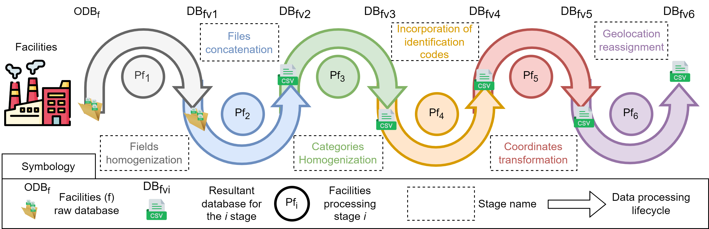
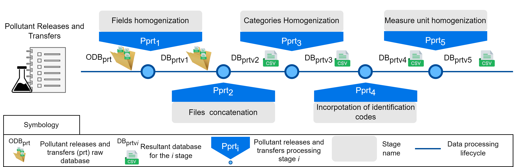

# Examples of scripts used for the data processing life cycle

This document describes the stages of the data processing life cycle followed to obtain *A Mexican Enhanced Dataset of Pollutant Releases and Transfers (2004 to 2022) with IARC Cancer Classifications* 

## Used pilelines 

We include the first two stages for the proposed methodology. The remaining stages will be included when the article is published.

### Fist steps: Initialize preprocessing

1. Download the data from the Semarnat
2. Acces to the datalifecycle folder
    ```sh
    cd datalifecycle
    ```
3. Execute the preparation scripts
    ```
    pip install pandas
    pip install numpy
    pip install pandas[excel]
    python3 p001_transform_to_csv.py
    python3 p002_prepare_columns.py
    ```

### Facilities dataset

Facilities data life cycle



1. Acces to the datalifecycle folder
2. Execute Facilities scripts

    ```
    python3 Pf1.py
    python3 Pf2.py
    ```

### Pollutant Releases and Transfer Dataset

Pollutant Releases and Transfer data life cycle




1. Acces to the datalifecycle folder
2. Execute PRT scripts 
    ```
    python3 Pprt1.py
    python3 Pprt2.py
    ```


## Dataset description report
The file *RETC20042022-IARC136_report.html* with the dataset description is in the *dataset_descriptor/Result/* path in this repository. However, we share the python script that reads the anonymized dataset and creates the report. The script is available in the *dataset_descritor* path. You can create the report by following the steps described in the following section.

## Create database description

Requirements:
    * Docker Community Edition: To deploy the creation process
    * Docker compose service
    * Internet connection: To download the Python container image

Download the dataset described in the *dataset_descriptor/datasource/DATASET.txt* file.

To create the dataset report, you must execute the following commands:
```sh
cd dataset_descriptor #Acces to the aplication 
docker compose up -d #Create the docker image and deploy the virtual container
docker exec -ti resume_db_retc bash #Access to the virtal container
python3 create_report.py #This process may take several minutes.
# To exit of the Virtual Container use the Ctrl + P + Q
docker compose down #Remove de container from your pc
```

