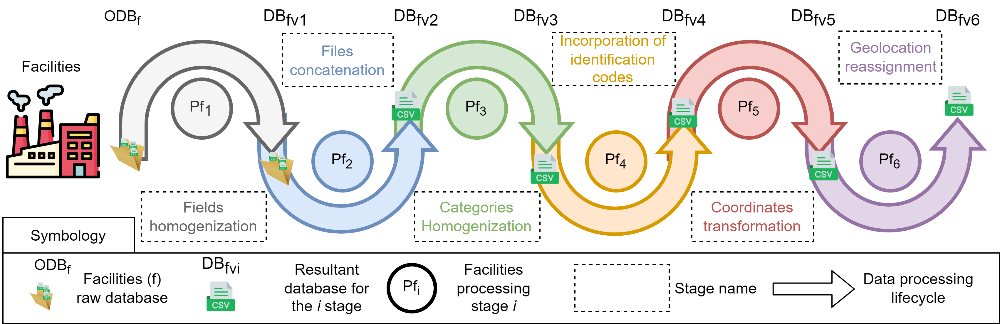
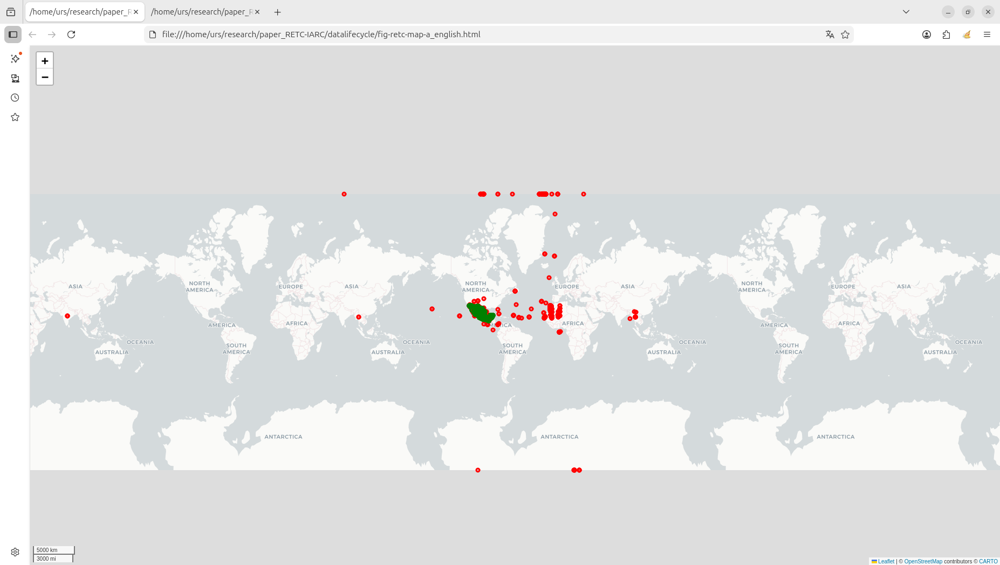
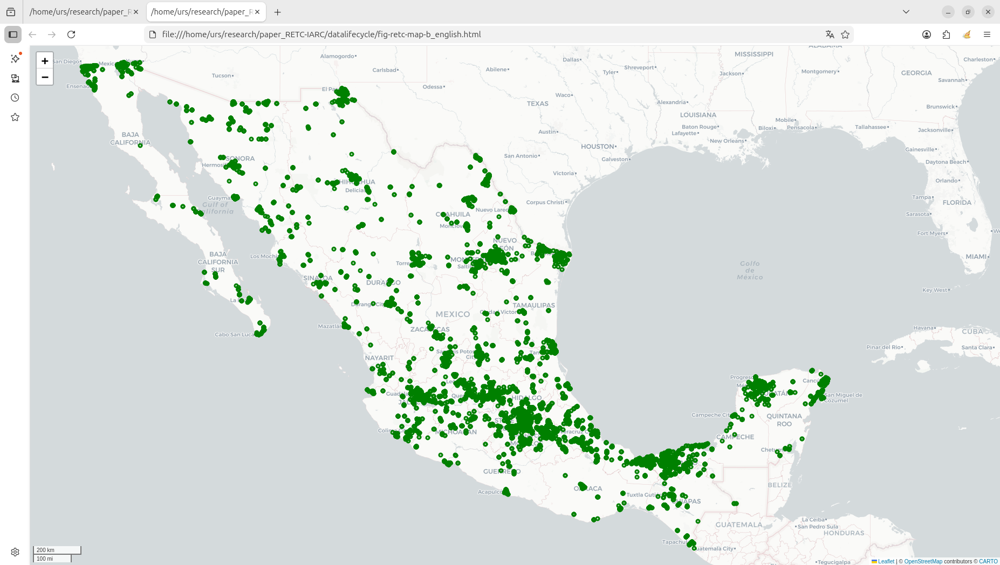
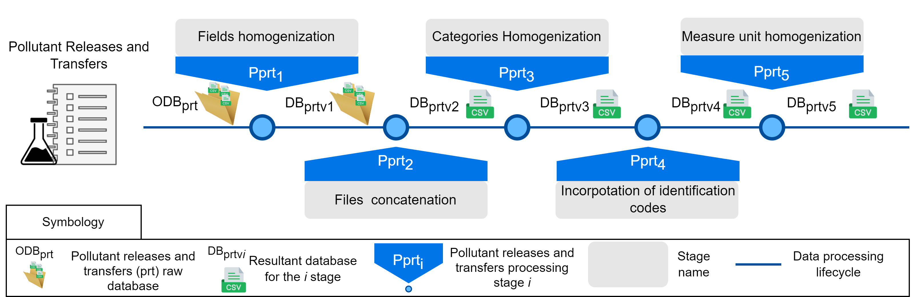

# Examples of scripts used for the data processing life cycle

This document describes the stages of the data processing life cycle followed to obtain *A Mexican Enhanced Dataset of Pollutant Releases and Transfers (2004 to 2022) with IARC Cancer Classifications* 

## Used pilelines 

We include the first two stages for the proposed methodology. The remaining stages will be included when the article is published.

### First steps: Initialise preprocessing

1. Download the data from the Semarnat
2. Access to the datalifecycle folder
    ```sh
    cd datalifecycle
    ```
3. Execute the preparation scripts
    ```
    pip install pandas
    pip install numpy
    pip install pandas[excel]
    pip install openpyxl
    pip install unidecode
    python3 p001_transform_to_csv.py
    python3 p002_prepare_columns.py
    ```

### Facilities dataset

Facilities data life cycle



1. Access to the datalifecycle folder
2. Execute Facilities scripts

    ```sh
    #Rename and order the columns for the 19 CSV files
    python3 Pf1.py
    #Create a unique dataset with the 19 CSV files
    python3 Pf2.py
    # Homogenise the sectors\' names
    python3 Pf3.py
    #Incorporate cve_ent and homogenize states\' names
    python3 Pf3y4_states.py
    #Incorporate cve_mun and homogenize municipalities\' names
    python3 Pf3y4_municipalities.py
    #Compute DMS to DD format transformation and assign categorical values for metadata
    python3 Pf5.py
    #Detect the facilities whose locations are in Mexico, including the cve_ent code
    python4 Pf6.py
    #Detect the facilities with location in their municipality name
    python4 Pf6_mun.py
    #Replace the latitude and longitude values for the facilities outside Mexico with the default values assigned by the research team
    python4 Pf6_maincc_municipality.py
    ```

#### Facilities location previous the Geolocation reassignment


#### Facilities location after the Geolocation reassignment



### Pollutant Releases and Transfer Dataset

Pollutant Releases and Transfer data life cycle




1. Access to the datalifecycle folder
2. Execute PRT scripts 
    ```
    python3 Pprt1.py
    python3 Pprt2.py
    ```

## Dataset description report
The file *RETC20042022-IARC136_report.html* with the dataset description is in the *dataset_descriptor/Result/* path in this repository. However, we share the Python script that reads the anonymised dataset and creates the report. The script is available in the *dataset_descritor* path. You can create the report by following the steps described in the following section.

## Create database description

Requirements:
    * Docker Community Edition: To deploy the creation process
    * Docker compose service
    * Internet connection: To download the Python container image

Download the dataset described in the *dataset_descriptor/datasource/DATASET.txt* file.

To create the dataset report, you must execute the following commands:
```sh
cd dataset_descriptor # Access to the application 
docker compose up -d #Create the Docker image and deploy the virtual container
docker exec -ti resume_db_retc bash #Access to the virtal container
python3 create_report.py #This process may take several minutes.
# To exit the Virtual Container, use Ctrl + P + Q
docker compose down #Remove the container from your pc
```